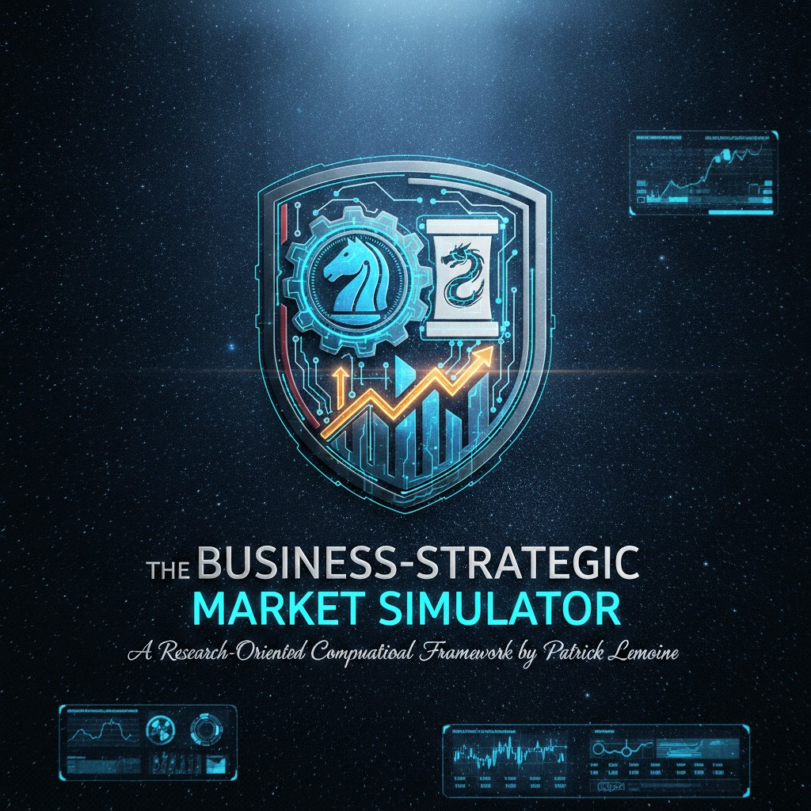
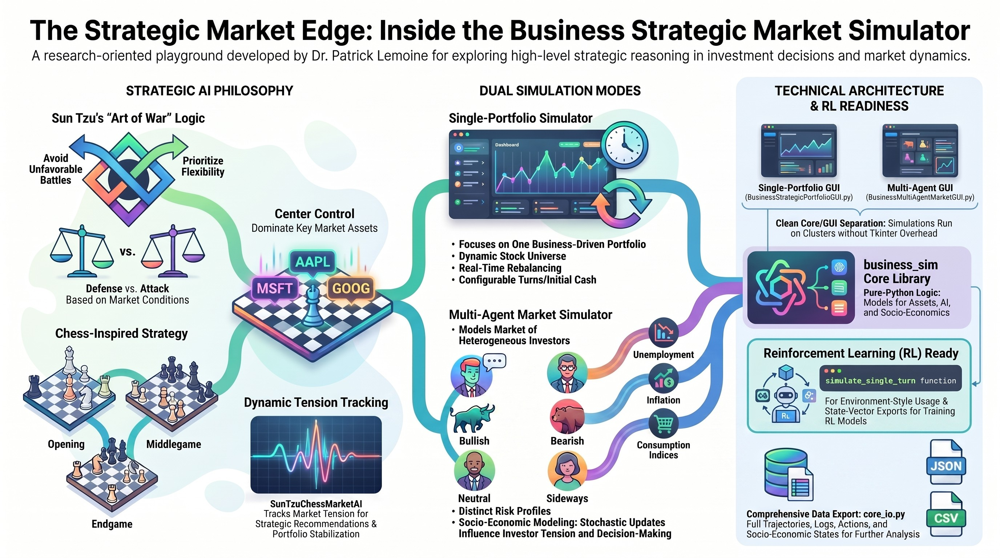

# Business Strategic Market Simulator

---

---

The **Business-Strategic-Market-Simulator** is a research-oriented computational framework designed to explore investment decision-making through the lens of strategic reasoning. Developed by Patrick Lemoine, the project integrates traditional market dynamics with non-traditional heuristic models, specifically Sun Tzu’s Art of War and classical chess strategy.

The system provides a modular architecture consisting of a single-portfolio strategy simulator, a multi-agent market environment, and a core engine optimized for Reinforcement Learning (RL) and High-Performance Computing (HPC). Key takeaways include:

- a **single‑portfolio “business strategy” simulator** with Sun Tzu and chess‑inspired AI,  
- a **multi‑agent market simulator** with heterogeneous investors and socio‑economic dynamics,  
- a **clean core / GUI separation** and **RL‑ready** export suitable for HPC experiments. 

The project uses live or simulated market data to explore how strategic reasoning can influence investment decisions in a business context. This is a continuation of the work from my previous repo. [github](https://github.com/lemoinep/BusinessStrategySimulator)

***

## Strategic Framework: Sun Tzu and Chess-Inspired AI

The central innovation of the simulator is the SunTzuChessMarketAI (housed in core_ai.py). This engine evaluates the market and dictates portfolio actions based on two primary strategic disciplines:

1. Chess Strategy Integration

The AI treats the market universe as a strategic board where different stocks represent various levels of tactical importance.

* Phases of Play: The AI categorizes the simulation into Opening, Middlegame, and Endgame phases, alongside a "Stability" phase.
* Center Control: Success is evaluated by dominance over high-cap "central" assets such as AAPL, GOOG, and MSFT.
* Prophylaxis: The AI employs preventative measures to guard against anticipated market shifts.

2. Sun Tzu’s Art of War Principles

The engine applies ancient military philosophy to financial management:

* Avoidance of Unfavorable Battles: The system assesses market "tension" to decide when to engage or withdraw.
* Flexibility and Posture: The AI alternates between Defense, Attack, and Stabilization patterns based on real-time market conditions.

## Mathematical Formulation

### 1. Strategic AI Modeling (Sun Tzu & Chess)

The state of the AI strategy, denoted as $S_{AI}$, is defined as a function of market tension and "center control".

**Strategic Tension ($T$)**  
It evolves over time ($t$) based on market conditions—fear $f$, volatility $v$, liquidity $l$—and socio-economic variables:

$$
T_t = \phi(f_t, v_t, l_t, U_t, I_t, CI_t)
$$

*Where $U$ is unemployment, $I$ is inflation, and $CI$ is the consumption index.*

**Center Control ($C$)**  
Inspired by chess strategy, this represents dominance over pivot assets such as AAPL, MSFT, or GOOG:

$$
C_t = \sum_{i \in \text{pivot assets}} w_i \cdot \text{Position}_i(t)
$$

*Where $w_i$ is the strategic weight of asset $i$.*

**Strategic Decision ($D$)**  
The AI selects a phase $P$ (Opening, Middlegame, Endgame, or Stability) and a posture (Attack, Defense, or Stabilization):

$$
D_t = f(T_t, C_t) \rightarrow P \in \{O, M, E, S\}
$$

---

### 2. Multi-Agent Market Dynamics

In your multi-agent simulator, each investor $j$ makes decisions based on their risk profile and the broader macro-environment.

**Socio-Economic State ($M$)**  
This state evolves stochastically at each turn:

$$
M_{t+1} = M_t + \epsilon_t \quad \text{where } M = \{U, I, CI\}
$$

**Agent Decision Function ($A_j$)**  
Each agent $j$ has a specific risk aversion $\alpha_j$. Their action (Buy, Sell, or Hold) is determined by AI logic:

$$
\text{Action}_{j,t} = \text{AI}_{logic}(T_t, C_t, \alpha_j)
$$

This logic applies **Art of War** principles, such as avoiding unfavorable battles and maintaining flexibility.

---

### 3. Portfolio Management and Rebalancing

The total portfolio value ($V$) at time $t$ is the sum of cash ($K$) and the value of all held assets ($A$):

$$
V_t = K_t + \sum_{i=1}^{n} (\text{Price}_{i,t} \times \text{Quantity}_{i,t})
$$

**Rebalancing**  
The simulator adjusts positions toward a target allocation $W^*$, which is modified by the AI's recommendations:

$$
W^*_{AI} = W^*_{initial} + \Delta D_t
$$

This adjustment occurs during the `simulate_single_turn` function to minimize the gap between the current state and the strategic target.

## Features

- **Single‑portfolio simulator (GUI)**  
  - Dynamic stock universe: user‑defined tickers (e.g. `NVDA, AMD, INTC, MSFT, SPY`). 
  - Sun Tzu + chess‑inspired AI (phases, tension, center control, defense/attack/stability). 
  - Real‑time allocation and rebalancing, configurable number of turns and initial cash. 
  - JSON and CSV export of simulation runs for further analysis or RL. 

- **Multi‑agent market simulator (GUI)**  
  - Multiple investors with different risk profiles and personalities (bullish / bearish / sideways).
  - Socio‑economic model (unemployment, inflation, consumption index) influencing market tension. 
  - Sun Tzu + chess‑based decision logic per agent (buy/sell/hold, center control). 
  - JSON export of multi‑agent trajectories (logs, actions, socio‑economic states, market conditions). 

- **Core engine ready for RL / HPC**  
  - Core package `business_sim` exposes pure‑Python models: assets, socio‑economics, AI, portfolio dynamics.
  - Single‑step simulation function `simulate_single_turn` for environment‑style usage.
  - State‑vector and report export (`core_io`) for offline RL dataset generation. 
  - Clear separation between **core logic** and **Tkinter GUIs**, making it easy to run large batches on clusters without any GUI. 

***

## Repository structure

The repository is organized to separate the **business/market logic** from the **user interfaces**:

- `business_sim` is the **core library** (no GUI, no Tkinter). 
- `BusinessStrategicPortfolioGUI.py` is the **single‑portfolio GUI front‑end**.
- `BusinessMultiAgentMarketGUI.py` (wrapper around `business_sim/gui_multi.py`) is the **multi‑agent GUI front‑end**. 

***

## Single‑portfolio simulator

The single‑portfolio simulator focuses on **one business‑oriented portfolio** managed by an AI that blends:

- Sun Tzu’s *Art of War* principles (avoid unfavorable battles, defense vs attack, flexibility),  
- chess strategy concepts (opening/middlegame/endgame, center control, prophylaxis).

### Key elements

- **PortfolioState** (in `core_portfolio.py`)  
  - Holds the list of `AssetType` objects, current cash, and market conditions (fear, liquidity, volatility). 
  - Can be initialized with default assets (AAPL, GOOG, TSLA, MSFT, SPY) or a custom list of tickers. 

- **SunTzuChessMarketAI** (in `core_ai.py`)  
  - Tracks tension over time and decides on phases: opening, middlegame, endgame, stability. 
  - Evaluates center control (e.g. dominance on AAPL/GOOG/MSFT) and generates strategic recommendations.
  - Influences market conditions and portfolio allocation via attack/defense/stabilization patterns.

- **Simulation loop**  
  - GUI collects: number of turns, initial cash, target allocation, custom tickers. 
  - `simulate_single_turn` updates market conditions, applies AI, rebalances towards the (possibly AI‑adjusted) target allocation, and produces a `turn_result` dictionary with metrics and logs. 
  - Results are appended to `sim_data` and can be exported.

***

## Multi‑agent market simulator

The multi‑agent simulator models a **small market of heterogeneous investors** interacting in a common environment. 
### Key elements

- **SocioEconomicState** (in `core_market.py`)  
  - Tracks unemployment, inflation, and consumption index, updated stochastically each turn. 
  - Feeds into the AI’s risk tension computations, affecting agent behavior. 

- **MultiAgentInvestor** (in `core_portfolio.py`)  
  - Each investor has a name, risk aversion, cash, and their own `AssetType` positions. 
  - Uses `SunTzuChessMarketAI` to evaluate tension and center control, then decide whether to buy, sell, or hold.

- **MultiAgentPortfolio** (in `core_portfolio.py`)  
  - Manages the socio‑economic state and shared market conditions. 
  - Holds a list of investors and coordinates their actions at each turn. 
  - `one_turn` updates the macro environment, lets each agent take actions, and returns a structured record (logs, actions, socio‑economic metrics, total market value). 

- **MultiAgent GUI** (`business_sim/gui_multi.py` + wrapper)  
  - Lets you choose the number of turns, number of agents, and base risk aversion. 
  - Displays socio‑economic evolution and all AI/agent logs directly in the Tkinter interface. 
  - Exports the full multi‑agent history to JSON.

***

---

## 📝 **Author**

**Dr. Patrick Lemoine**  
*Engineer Expert in Scientific Computing*  
[LinkedIn](https://www.linkedin.com/in/patrick-lemoine-7ba11b72/)

---

